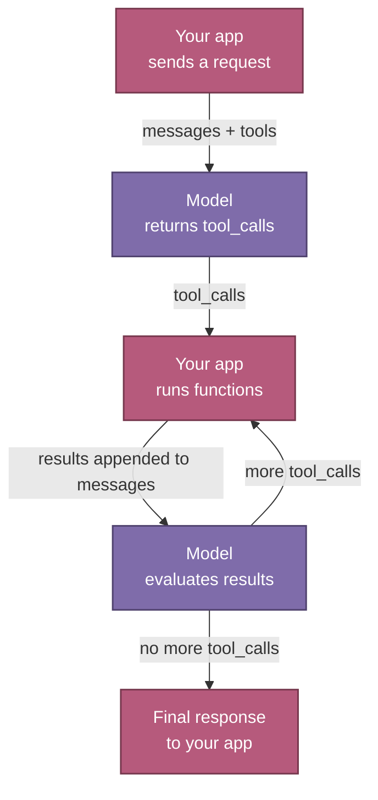

> ## Documentation Index
> Fetch the complete documentation index at: https://docs.together.ai/llms.txt
> Use this file to discover all available pages before exploring further.

# Function calling patterns

> Function calling lets LLMs respond with structured function names and arguments your application can execute.

Function calling (also called *tool calling*) lets LLMs respond with structured function names and arguments that you can execute in your application. It enables models to interact with external systems, retrieve real-time data, and power agentic AI workflows.

Pass function descriptions to the `tools` parameter, and the model returns `tool_calls` when it determines a function should be used. You then execute these functions and optionally pass the results back to the model for further processing.

## Patterns

Function calling fits a handful of common shapes. Pick the one that matches what you're building, then follow the link for runnable Python, TypeScript, and cURL examples.

| Pattern               | Description                               | Use cases                            | Page                                                                                           |
| --------------------- | ----------------------------------------- | ------------------------------------ | ---------------------------------------------------------------------------------------------- |
| **Simple**            | One function, one call                    | Basic utilities, simple queries      | [Call functions](/docs/inference/function-calling/single-call#simple-function-calling)         |
| **Multiple**          | Choose from many functions                | Many tools, model has to choose      | [Call functions](/docs/inference/function-calling/single-call#multiple-function-calling)       |
| **Parallel**          | Same function, multiple calls in one turn | Complex prompts, batched lookups     | [Parallel calls](/docs/inference/function-calling/parallel#parallel-function-calling)          |
| **Parallel multiple** | Multiple functions, parallel calls        | Single requests that need many tools | [Parallel calls](/docs/inference/function-calling/parallel#parallel-multiple-function-calling) |
| **Multi-step**        | Sequential function calling in one turn   | Data-processing workflows            | [Agentic patterns](/docs/inference/function-calling/agentic#multi-step-function-calling)       |
| **Multi-turn**        | Conversational context plus functions     | Agents with humans in the loop       | [Agentic patterns](/docs/inference/function-calling/agentic#multi-turn-function-calling)       |
| **Vision**            | Tool use with image inputs                | Extract structured data from images  | [Vision-language function calling](/docs/inference/vision/function-calling)                    |

## Supported models

For the current list of models that support function calling, see the [serverless](/docs/serverless/models) and [dedicated model inference](/docs/dedicated-endpoints/models) catalogs.

## Next steps

* [Call functions](/docs/inference/function-calling/single-call): one tool call per response (simple and multiple).
* [Call functions in parallel](/docs/inference/function-calling/parallel): multiple tool calls in one response.
* [Agentic patterns](/docs/inference/function-calling/agentic): multi-step and multi-turn loops.
* [Vision-language function calling](/docs/inference/vision/function-calling): combine image understanding with tool use on VLMs.
* [Best practices](/docs/inference/function-calling/best-practices): design tools and control selection for reliable calls.
